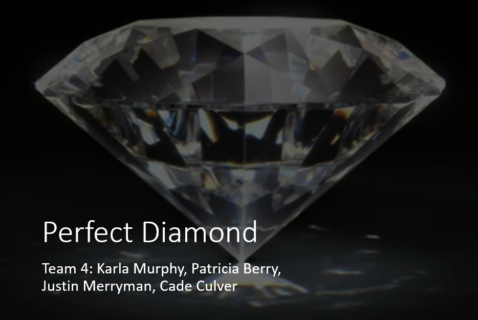
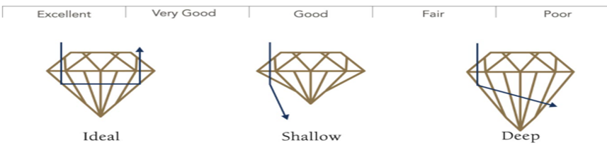
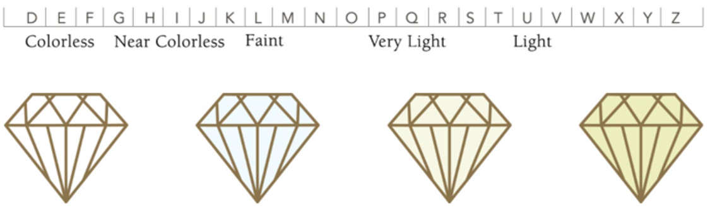
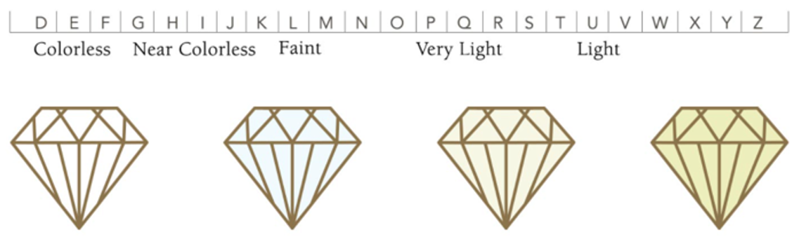
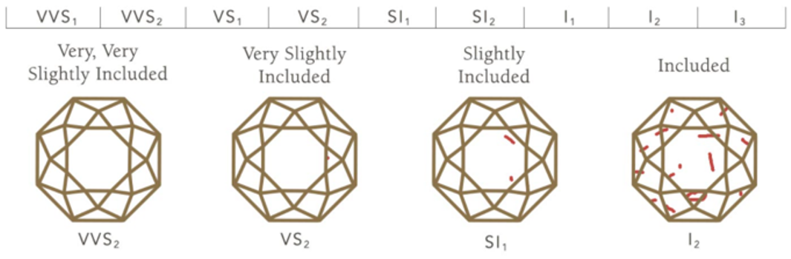
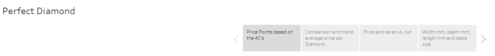
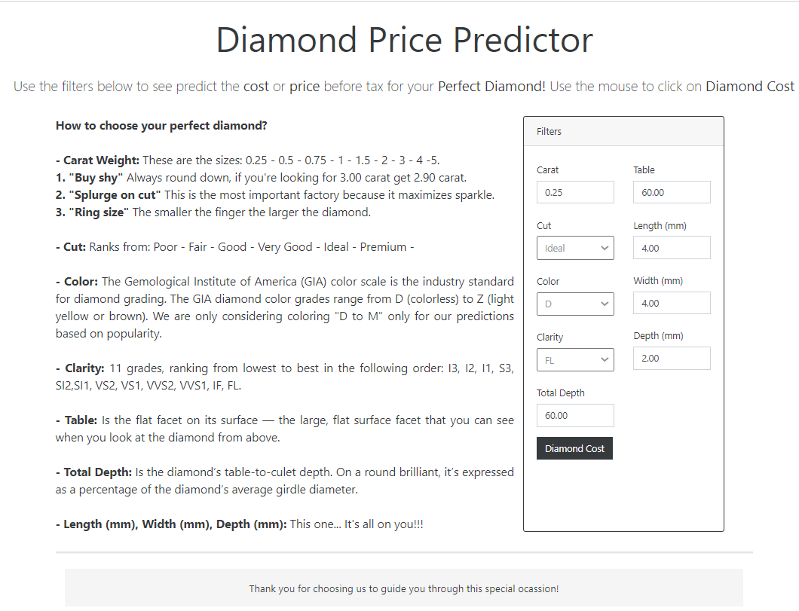
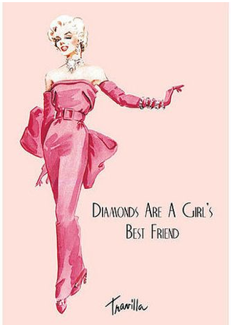

# The Perfect Diamond
******************************
### Deployment page: https://perfect-diamond.herokuapp.com/
******************************

****************

### Diamonds have been defined as a girl’s best friend and have been a coveted possession for years.

How do you go about finding the right diamond at the right price?
  * Our team investigated pricing and the anatomy of a diamond to create a pricing predictor to help the user to buy the best choice for their budget and preference.  
To choose the perfect diamond, you must follow and understand the 4C’s that determine the price of the diamond.
The data was selected from Kaggle and was in a csv format.  

### Tips to choose the perfect diamond:
  <b>1. Cut:</b>  The most important of the 4 C’s is cut.  Cut drives how much a diamond sparkles.

  <b>2. Color:</b> Is the second most important feature in diamond selection.  The less color that a diamond has the higher the grade of the diamond. 

  <b>3. Clarity:</b> Defines the degree that a diamond is flawed.  Clarity grade is based on the size, number, position of, and color of the diamond’s flaws.

  <b>4. Carat:</b> The carat weight refers to a diamond’s total weight; not size. 

*****************

## Web Application

 #### Tableau

We created 4 dashboards in Tableau to visualize all aspects of price utilizing the 4Cs and other measures:
    - Number of times sold at a certain price point/Carat dependency on price.
    - Average price dependency on the 4Cs trend.
    - Price vs. Carat based on Cut.
    - All other measures impact on pricing.

  #### Machine Learning
  
   - Identification of the correlation between features of the dataset.
   - Process of running every Linear Regression and Decision Tree models to find the best model for the Price Predictor tool.
   - Linear Regression chosen due to best fit for data in accuracy, predictability and R2. 
   - Predictability model with step by step instructions for ease of use.
 

*****************

### Final Remarks

* Conclusion:  the more perfect the diamond the more expensive the price.  While many factors go into the pricing, the bottom line is size, cut, clarity and color do matter.
 

* Recommendations:  do your research.  It is best to be prepared prior to walking into the jewelry store to purchase to avoid getting something that is not right for you and paying too much.
 

* Limitations:  the data was old and did not include one important key feature in choosing a diamond – shape.
 

* Future work:  more extensive look at additional sources of data that would be more recent and included shape for the best model possible

